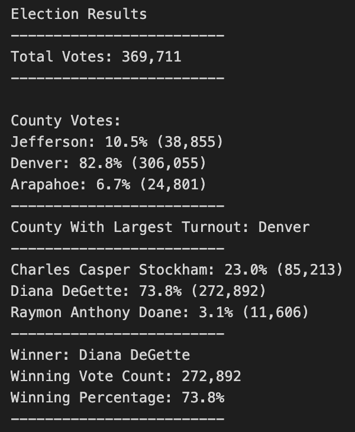

# Election Results

## Overview of Election Audit
A Colorado Board of Elections employee has given you the following tasks to complete the election audit of a recent local congressional election.

1. Calculate the total number of votes cast.
2. Get a complete list of candidates who received votes.
3. Calculate the total number of votes each candidate received.
4. Calculate the percntage of votes each candidate won.
5. Calculate the total number of votes cast in each county.
6. Determine the county with the highest voter turnout.
7. Determine the winner of the election based on the popular vote.

## Resources
- Data Source: election_results.csv
- Software: Python 3.9.7, Visual Studio Code, 1.62.3

## Election Audit Results
The analysis of the election show that:
- There were 369,711 votes cast in the election across 3 counties.
- The candidates were:
  - Charles Casper Stockham
  - Diana DeGette
  - Raymon Anthony Doane
- The counties that cast votes were:
  - Denver
  - Jefferson
  - Araphoe
- The results were:
  - Charles Casper Stockham received 23.0% of the vote and 85,213 votes.
  - Diana DeGette received 73.8% of the vote and 272,892 votes.
  - Raymon Anthony Doane received 3.1% of the vote and 11,606 votes
- The winner of the election was:
  - Diana DeGette who received 73.8% of the vote and 272,892 votes.
- The county with the highest voter turnout was:
  - Denver with 82.8% of the votes and 306,055 votes

  
## Election Audit Summary
The code used to perform this election audit could truly be used for any election. The first thing that would need to be done to perform this audit on another election is to change the file reference to choose a different csv file to read in order to perform a new analysis of a different election. For example, if we wanted to audit a presidential election and we had a csv file named "presidential_election_results.csv" within our same "Resources" folder we could take the below code from this audit, which defines the variable "file_to_load" for use throughout the code where we want to reference this csv file:

`
  file_to_load = os.path.join("Resources", "election_results.csv")
`

To:

`
  file_to_load = os.path.join("Resources", "presidential_election_results.csv")
`

Now we are are using our same code, but for a presidential election. Another modification to this code that would need to be made is if, say, the columns of this csv file containing the presidential election were not in the same order as this election we audited. In the file for this election, the columns of the data were "Ballot ID", "County" and "Candidate", in that order. If our presidential election contained four columns: "Ballot ID", "State", "County", "Candidate", our candidate name would be found in the fourth column from the left, rather than the third in this audit we just performed. In this case, we'd need to modify the below pieces from our audit code:

`
candidate_name = row[2]
`

`
county_name = row[1]
`

To:

`
candidate_name = row[3]
`

`
county_name = row[2]
`

Keeping in mind that our columns begin with the first being 0, the candidate name field would be indexed as 3 within the row function to notate that it is in the fourth column from the left, and the county name is now in the third column, requiring the row function to be indexed as 2.
